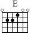
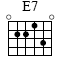
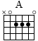
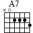
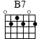
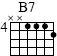

# Guitar Resources

### Some Pieces:
- [Berimbau by Baden Powell (arrangement by Roland Dyens)](https://www.youtube.com/watch?v=3RrcXqOZ20k)
- [Kaori Muraji : Roland Dyens -Saudade No 3](https://www.youtube.com/watch?v=jx_lqeeA9fI)

### Scales:
- [Using the Pentatonic Scale in Major Keys](https://www.youtube.com/watch?v=vzKPU--iCDg)
 
### Blues:
  - [Beginners Blues](http://12bar.de/cms/tutorial/beginners-blues/)

Common 12-bar blues progressions:

E7 – E7 – E7 – E7  
A7 – A7 – E7 – E7  
B7 – A7 – E7 – B7  
   

E7 – A7 – E7 – E7  
A7 – A7 – E7 – E7  
B7 – A7 – E7 – B7  
 
 
Chords:
 

 

 

 

 

 

 
 
 
### Songs:

[Recommended Songs to Learn (by Reddit users)](https://github.com/axs221/recommended-guitar-songs/blob/master/README.md)

Song of the Ancients (Devola) - Nier

https://www.gametabs.net/nier/song-ancients-devola-1

CAPO ON 3rd FRET

First part :
X02213 Am9  
133210 Fm7  
X00230 Dsus2  
022100 E  
X02210 Am  
302210 Am7  
133210 Fm7  
X03230 Dmadd9  
022100 E  

Repeat once.

Then, part 2 :
X02210 Am  
022130 E7  
032013 C  
002220 A  
X00230 Dsus2  
032013 C  
X03230 Dmadd9  
022100 E  

Part 3 :
X02210 Am  
022130 E7  
032013 C  
002220 A  
X00230 Dsus2  
022100 E  
133210 Fm7  
022100 E  

Then repeat part 2, then part 3.
